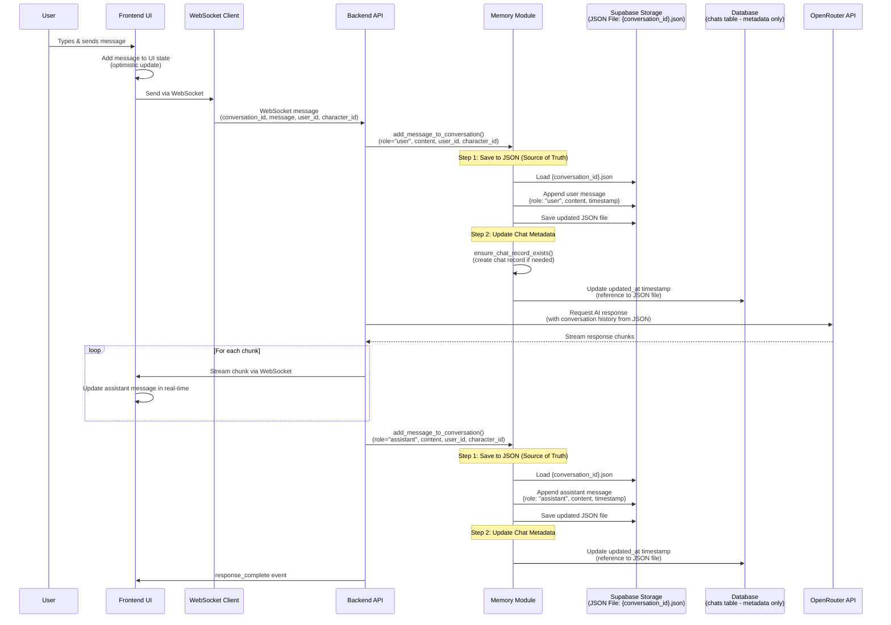
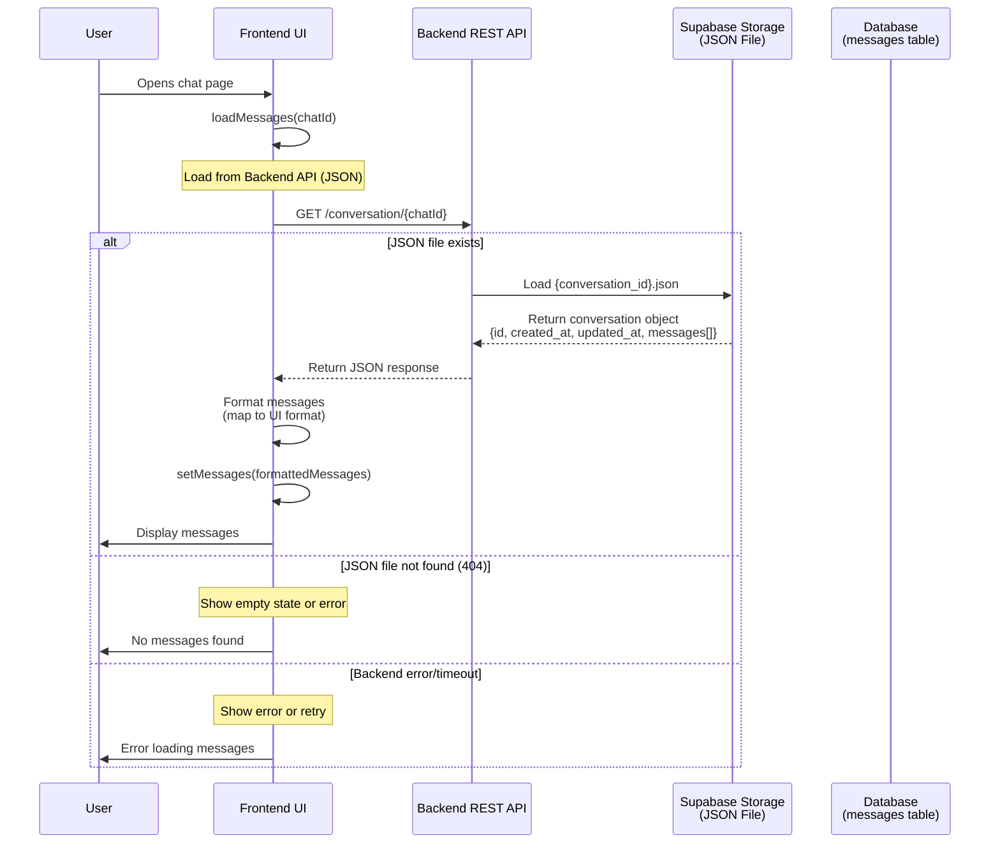

# Message Flow Documentation

This document explains how messages are saved and how the UI accesses them for display.

## Architecture Overview

The system uses a **JSON-first architecture** where:
- **JSON files in Supabase Storage** are the **ONLY source of truth** for messages
- **Database `chats` table** only stores **metadata** (user_id, character_id, timestamps)
- The JSON file is named `{conversation_id}.json` and contains all messages

```mermaid
graph TB
    subgraph "Frontend (Next.js)"
        UI[Chat UI Component]
        WS[WebSocket Client]
    end
    
    subgraph "Backend (FastAPI)"
        API[REST API]
        WS_Handler[WebSocket Handler]
        Memory[Memory Module]
    end
    
    subgraph "Storage"
        JSON[Supabase Storage<br/>JSON Files<br/>SOURCE OF TRUTH<br/>{conversation_id}.json]
        DB[(Supabase Database<br/>chats table<br/>METADATA ONLY<br/>id, user_id, character_id, timestamps)]
    end
    
    UI -->|Send Message| WS
    WS -->|WebSocket| WS_Handler
    WS_Handler -->|Save Message| Memory
    Memory -->|1. Save to JSON| JSON
    Memory -->|2. Update chat metadata| DB
    
    UI -->|Load Messages| API
    API -->|Load from JSON| JSON
    JSON -->|Return Messages| UI
    
    DB -.->|Reference only| JSON
```

## Message Saving Flow

When a user sends a message, here's the complete flow:



## Message Loading Flow

When the UI loads messages for display:



## Data Structures

### JSON File Structure (Source of Truth)

Stored in Supabase Storage as `{conversation_id}.json`:

```json
{
  "id": "71d20e34-c2ae-48e1-812b-18cfe7e3c4ce",
  "created_at": "2025-12-15T00:20:51.808801",
  "updated_at": "2025-12-15T00:21:20.056246",
  "messages": [
    {
      "role": "user",
      "content": "My name is Alice and I love programming.",
      "timestamp": "2025-12-15T00:20:51.809271"
    },
    {
      "role": "assistant",
      "content": "Hello Alice! It's wonderful to meet...",
      "timestamp": "2025-12-15T00:20:57.615398"
    }
  ]
}
```

### Database Table Structure (Metadata Only)

**Table: `chats`** (Metadata reference to JSON file)
```sql
CREATE TABLE chats (
  id UUID PRIMARY KEY,                    -- conversation_id (also JSON filename: {id}.json)
  user_id UUID REFERENCES auth.users(id),
  character_id UUID REFERENCES characters(id),
  created_at TIMESTAMP WITH TIME ZONE,    -- When chat was created
  updated_at TIMESTAMP WITH TIME ZONE     -- When JSON file was last modified
);

-- Index on conversation_id (primary key)
-- Index on user_id for querying user's chats
-- Index on character_id for querying character chats
-- Index on updated_at for sorting by recent activity
```

**Note:** The `messages` table has been removed. All messages are stored in the JSON file `{conversation_id}.json` in Supabase Storage.

## Key Functions

### Backend Functions

#### `add_message_to_conversation()`
**Location:** `router-backend/memory.py`

Saves a message to JSON file (source of truth) and updates chat metadata:
1. **Save to JSON:** Appends message to `{conversation_id}.json` in Supabase Storage
2. **Update metadata:** Updates `updated_at` timestamp in `chats` table

```python
add_message_to_conversation(
    conversation_id: str,  # Also the JSON filename: {conversation_id}.json
    role: str,  # "user" or "assistant"
    content: str,
    user_id: Optional[str] = None,  # For chat metadata
    character_id: Optional[str] = None  # For chat metadata
)
```

#### `update_chat_timestamp()`
**Location:** `router-backend/memory.py`

Updates the `updated_at` timestamp in the `chats` table when the JSON file is modified.
This provides a reference point for when the conversation was last updated.

```python
update_chat_timestamp(conversation_id: str)
```

### Frontend Functions

#### `loadMessages()`
**Location:** `v0-gooner-ai-clone/app/chat/[uuid]/page.tsx`

Loads messages from JSON file via backend API:

```typescript
const loadMessages = async (chatIdToLoad: string) => {
  // Load from backend API (JSON file: {chatIdToLoad}.json)
  const response = await fetch(`${backendUrl}/conversation/${chatIdToLoad}`)
  
  if (response.ok) {
    // Use JSON data (source of truth)
    const conversation = await response.json()
    setMessages(formatMessages(conversation.messages))
  } else {
    // Handle error (404 = no conversation, other = server error)
    console.error("Failed to load conversation")
  }
}
```

## API Endpoints

### Get Conversation (JSON Source of Truth)
```
GET /conversation/{conversation_id}
```
Returns the conversation JSON file from Supabase Storage (`{conversation_id}.json`).

**Response:**
```json
{
  "id": "uuid",
  "created_at": "ISO timestamp",
  "updated_at": "ISO timestamp",
  "messages": [
    {
      "role": "user",
      "content": "message content",
      "timestamp": "ISO timestamp"
    }
  ]
}
```

## Why This Architecture?

### JSON as Source of Truth
- ✅ **Complete history:** All messages in one file
- ✅ **Atomic writes:** Entire conversation saved together
- ✅ **Backup-friendly:** Easy to export/import
- ✅ **Version control:** Can track conversation changes
- ✅ **Simple:** Single source of truth, no sync complexity
- ✅ **Efficient:** No duplicate storage of message content

### Database as Metadata Store
- ✅ **Fast queries:** Indexed for quick chat list lookups
- ✅ **Relational data:** Links to users, characters
- ✅ **Timestamps:** Track when conversations were last updated
- ✅ **Minimal storage:** Only stores references, not message content

### Benefits
- **Simplicity:** Single source of truth (JSON), no sync needed
- **Performance:** JSON for message operations, DB for metadata queries
- **Storage efficiency:** Messages stored once in JSON, not duplicated in DB
- **Reliability:** JSON file contains complete conversation history

## Error Handling

### When Saving Messages

```mermaid
graph TD
    Start[User sends message] --> SaveJSON[Save to JSON file<br/>{conversation_id}.json]
    SaveJSON -->|Success| UpdateMetadata[Update chat metadata<br/>updated_at timestamp]
    SaveJSON -->|Failure| LogError[Log error, fail operation]
    UpdateMetadata -->|Success| Done[Message saved]
    UpdateMetadata -->|Failure| LogWarning[Log warning, continue]
    LogWarning --> Done
    Note1[JSON save failure = critical<br/>Metadata update failure = warning]
```

**Behavior:**
- **JSON save failure:** Operation fails (JSON is source of truth)
- **Metadata update failure:** Logged as warning, operation continues (metadata is optional)

### When Loading Messages

```mermaid
graph TD
    Start[Load messages] --> TryBackend[Try backend API<br/>GET /conversation/{id}]
    TryBackend -->|Success| UseJSON[Use JSON data<br/>{conversation_id}.json]
    TryBackend -->|404| ShowEmpty[Show empty state<br/>No conversation found]
    TryBackend -->|Error/Timeout| ShowError[Show error to user]
    UseJSON --> Display[Display messages]
```

**Behavior:**
- **Backend API success:** Use JSON data (source of truth)
- **Backend API 404:** Show empty state (conversation doesn't exist)
- **Backend API error:** Show error to user, allow retry

## File Naming Convention

The JSON file is named after the conversation ID:
- **Filename:** `{conversation_id}.json`
- **Location:** Supabase Storage bucket (configured via `SUPABASE_STORAGE_BUCKET`)
- **Example:** `71d20e34-c2ae-48e1-812b-18cfe7e3c4ce.json`

The database `chats.id` matches the `conversation_id`, providing a direct reference to the JSON file.

## Summary

1. **Saving:** Messages are saved to JSON file `{conversation_id}.json` (source of truth), then chat metadata is updated in database
2. **Loading:** UI loads messages from JSON file via backend API `GET /conversation/{conversation_id}`
3. **Architecture:** JSON-first architecture - JSON contains all messages, database only stores metadata
4. **Source of Truth:** JSON files in Supabase Storage contain the complete, authoritative conversation history
5. **Database Role:** The `chats` table only stores metadata (user_id, character_id, timestamps) and references the JSON file by ID

